# Habit Tracker Widget
### (Inspired by James Scholz)

> 🎥 Credit: [James Scholz's YouTube Video](https://youtu.be/Cu-IMFl37LA?t=138)

A simple and customizable habit tracker widget built for **Scriptable** on iOS.  
Track your daily progress across up to six habits directly from your Home Screen with a clean and minimal design.

---

## Features

- **Daily Habit Tracking**: Log your daily habits quickly.
- **Theme Customization**: Choose from 7 built-in themes to match your style.
- **Habit Customization**: Edit the six habits easily whenever you want.
- **Automatic Monthly Reset**: Automatically resets and backs up your habit data when a new month starts.
- **Manual Reset Option**: Manually export and reset your data anytime.
- **Compact and Visual Layout**: View your entire month at a glance with simple dot indicators.
- **Dynamic Updates**: Changes to habits and themes are instantly reflected.

---

## Visual Example

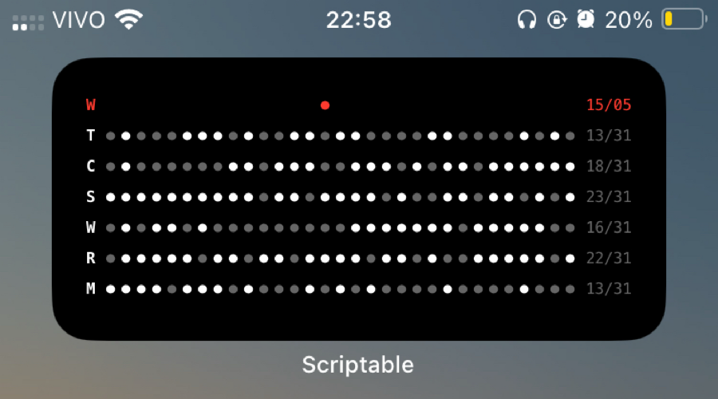

The widget displays:
- A row with the weekday initial, daily dots for the current month, and today's date.
- Individual rows for each habit showing progress and a counter like `12/30`.

---

## How It Works

---

### 1. Changing Habits

Customize your six habits by selecting **Change Habits**.  
You will be prompted to enter **six habit names separated by commas**.

Example input:
```
Sleep, Training, Cardio, Water, Reading, Meditation
```

After saving, your widget will immediately display the new habits.

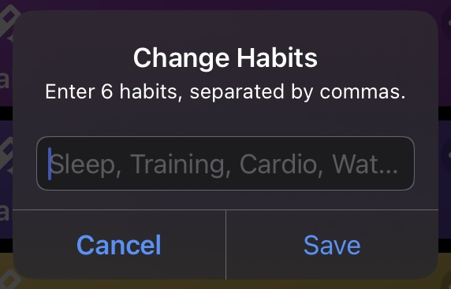

---

### 2. Resetting the Month

There are **two ways** the month can be reset:

- **Automatic Reset**:  
  At the start of a new month, the widget automatically:
  - Exports a summary of your previous month's habit performance to the clipboard,
  - Resets the tracker for the new month.

You do **not need to manually reset** this happens automatically.

- **Manual Reset**:  
  If you want to reset before the month ends, select **Reset Month** inside the app:
  - It will export the current month's data to the clipboard,
  - Then reset your tracker manually.

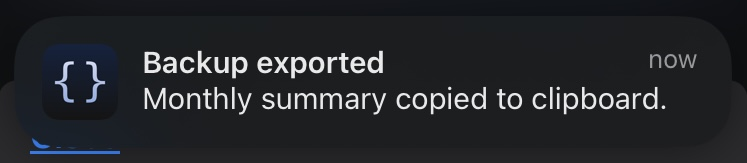
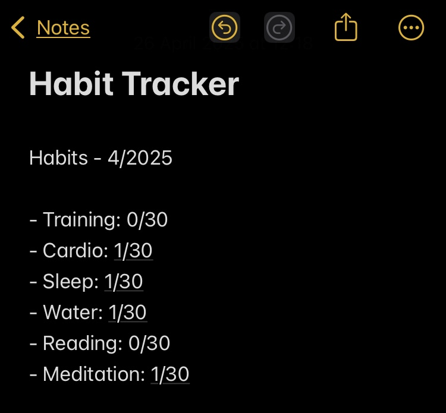

---

### 3. Choosing a Theme

Change the widget's appearance with the **Select Theme** option.  
Available themes:

- Classic Dark

- Classic Light
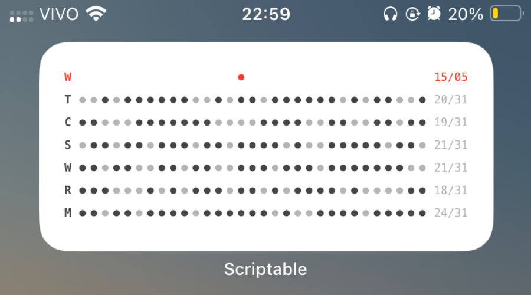
- Midnight Blue
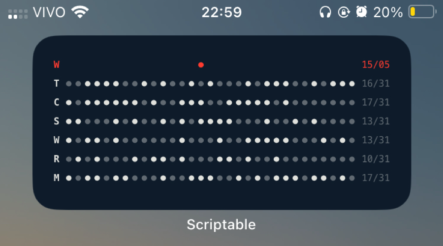
- Solarized Dark
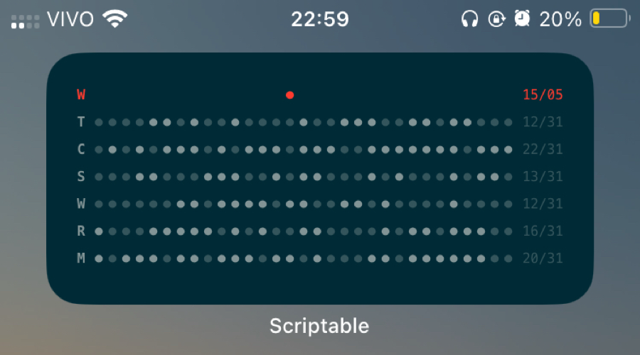
- Nordic Night
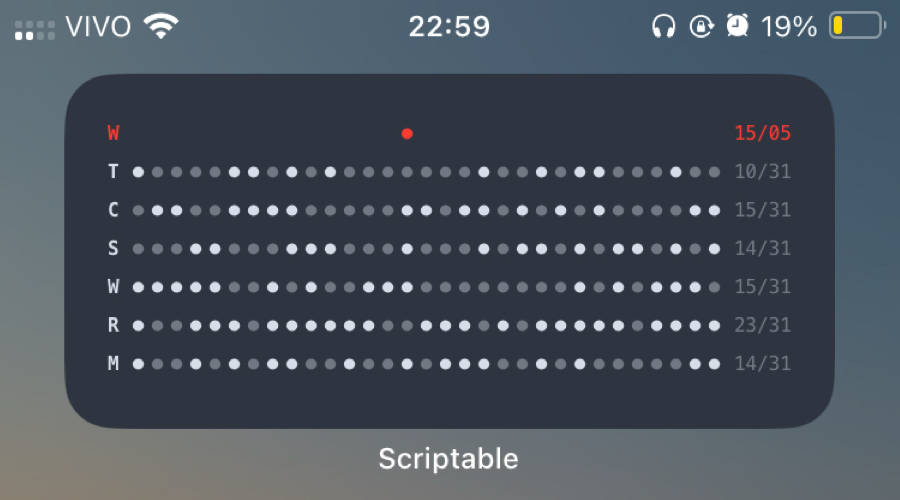
- Paper White
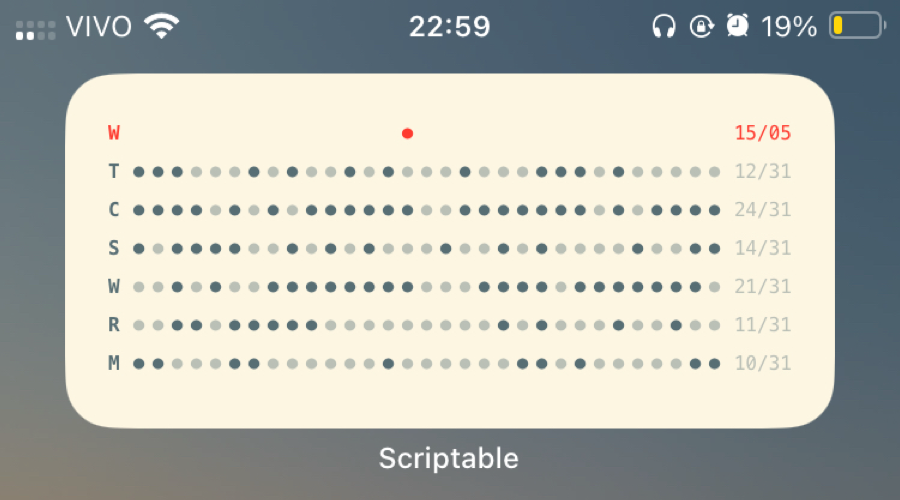
- Sweet Pink
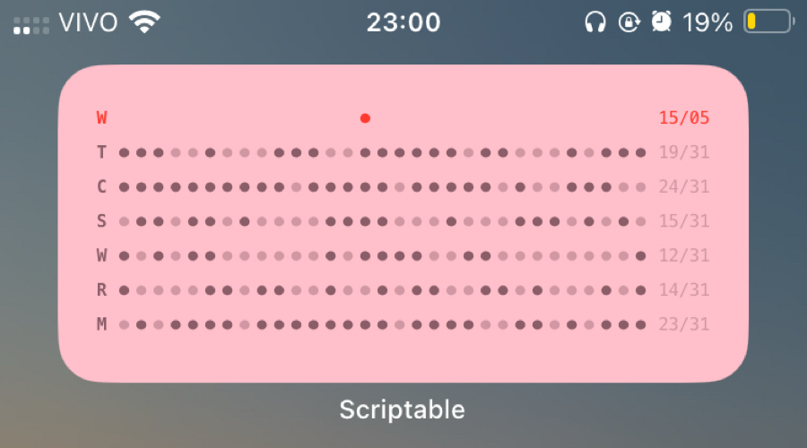

Each theme adjusts background and font colors to match different moods and styles.

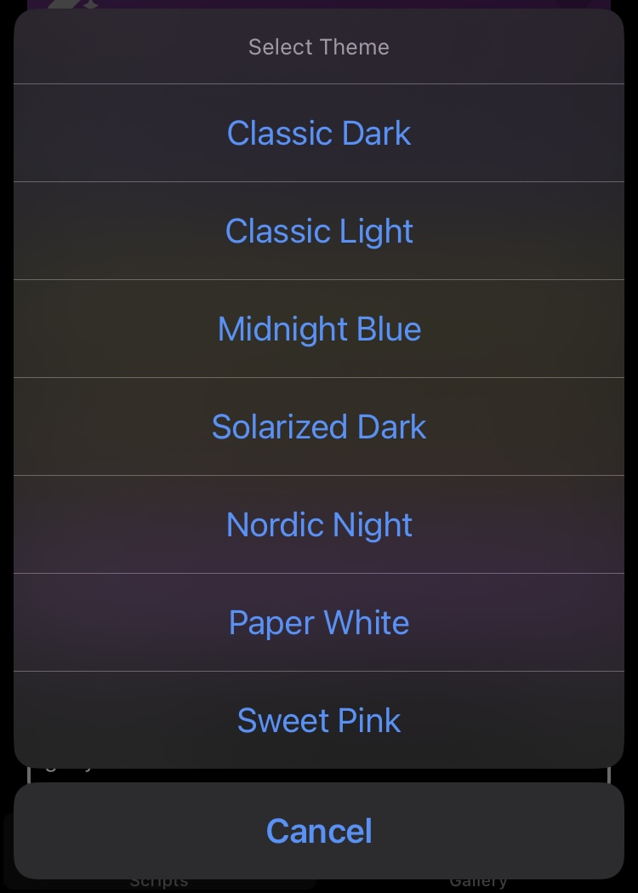

---

### 4. Tracking Habits (Check-in)

You can mark a habit for today inside the Scriptable app by selecting **Check-in**.  
Each habit row shows daily progress with small dots:
- **Filled dot** = Habit completed.
- **Unfilled dot** = Habit not completed.

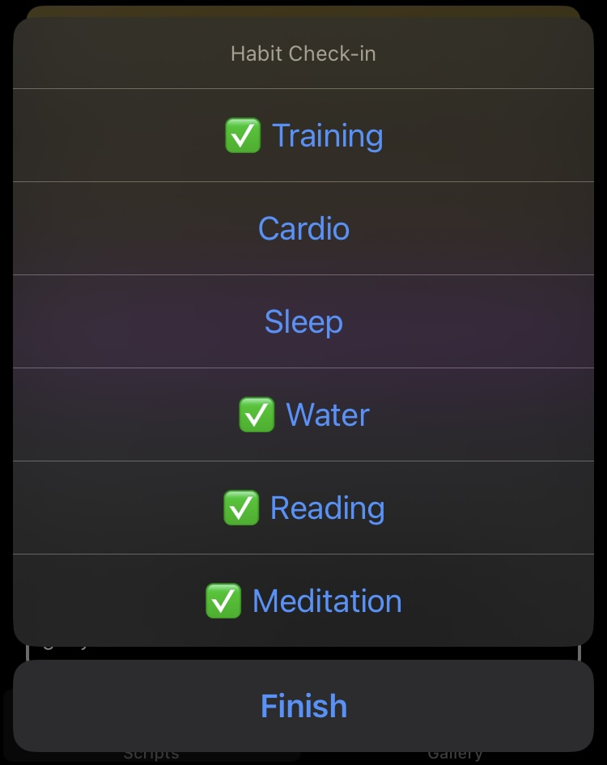

---

## Setup Instructions

1. Install [Scriptable](https://apps.apple.com/app/scriptable/id1405459188) from the App Store.
2. Create a new script and paste the full code.
3. Run the script inside Scriptable to configure your habits and preferences.
4. Add a Scriptable widget to your Home Screen.
5. Link the newly created script to the widget.

Done! Your habit tracker is now live and ready.

---

## License

This project is free for personal use.  
Feel free to modify, adapt, and improve it for your needs.

---
